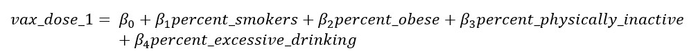
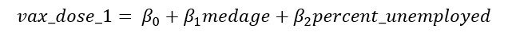

```{r setup, include=FALSE}
knitr::opts_chunk$set(echo = TRUE)
library(data.table)
library(tidycensus)
library(tidyverse)
library(ggridges)
library(patchwork)
library(viridis)
library(modelr)
library(mgcv)
library(readxl)
library(plotly)

knitr::opts_chunk$set(
	echo = TRUE,
	warning = FALSE,
	fig.width = 8, 
  fig.height = 6,
  out.width = "90%")

theme_set(theme_minimal() + theme(legend.position = "bottom"))

options(
  ggplot2.continuous.colour = "viridis",
  ggplot2.continuous.fill = "viridis")

scale_colour_discrete = scale_colour_viridis_d
scale_fill_discrete = scale_fill_viridis_d
```


```{r census_data, results = FALSE, message = FALSE}
census_api_key("aa512886c5449a582d837da8d3a07af66a043fe5")

census_data <- load_variables(2020, "acs5", cache=T)
fwrite(census_data, "census_variables.csv")

vars <- c(tpop = 'P001001',
          medage = 'P013001',
          wpop = 'P003002',
          bpop = 'P003003',
          apop = 'P003005',
          hpop = 'P004003')

nys_df <- get_decennial(state = "ny", 
                       geography = "county",
                       variables = vars,
                       geometry = T,
                       output = "wide")

nys_df = nys_df %>%
  mutate(
    county = gsub(" County, New York","",NAME))

nys_df$race_div <- 1 - (((nys_df$wpop*(nys_df$wpop-1))+
                          (nys_df$bpop*(nys_df$bpop-1))+
                          (nys_df$hpop*(nys_df$hpop-1))+
                          (nys_df$apop*(nys_df$apop-1)))/
                         (nys_df$tpop*(nys_df$tpop-1)))

nys_df = nys_df %>% 
  select(tpop, medage, county, race_div)
```


### NEW CODE! 

I added a new "sub_var_YY" dataset for each HR year and then merged that new df with the demo and HR ones.

Lastly, we imported data from the sheet labeled "Ranked Measure Data" to import the sub-variables that make up the Health Behaviors Ranking. We imported the variables county, percent of smokers, percent of adults with obesity, food environment index (0-10 with 10 as the best), percent of adults who are physically inactive, percent of adults with access to location with opportunities to exercise, percent of adults who report excessive drinking, percent of driving related deaths with alcohol involved, the number of chlamydia cases, and the teen birth rate per every 1000 females aged 15-19.


```{r, results = FALSE, message = FALSE} 
# 2019 HR Data

hr2019 = read_excel('data/ny_hr19.xls', sheet = 'Outcomes & Factors SubRankings', skip = 1) %>% 
  janitor::clean_names() %>% 
  slice(-c(1)) %>% 
  select(-starts_with("z"), -fips, -state) %>% 
  rename(longevity_r = rank_5,
         qol_r = rank_7,
         health_beh_r = rank_9,
         clinical_care_r = rank_11,
         ses_r = rank_13,
         env_r = rank_15)

demo2019 = read_excel('data/ny_hr19.xls', sheet = 'Additional Measure Data', skip = 1) %>% 
  janitor::clean_names() %>% 
  slice(-c(1)) %>% 
  select('county', 
         'segregation_index_2',
         'household_income',
         'percent_hispanic',
         'percent_african_american') %>% 
  rename(median_income = household_income,
         segregation_score = segregation_index_2,
         p_hispanic = percent_hispanic,
         p_black = percent_african_american) %>%
    mutate(segregation = case_when(segregation_score < 30 ~ 0,
                                 segregation_score >= 30 ~ 1),
           p_minority = p_black + p_hispanic)


sub_var19 =
  read_excel('data/ny_hr19.xls', sheet = 'Ranked Measure Data', skip = 1) %>% 
  janitor::clean_names() %>% 
  slice(-c(1)) %>%
  select(county, percent_smokers, percent_obese, food_environment_index, percent_physically_inactive, percent_with_access, percent_excessive_drinking, percent_alcohol_impaired, number_chlamydia_cases, teen_birth_rate, percent_unemployed)
  

list_2019 =
  list(hr2019, demo2019, sub_var19)

total2019 = 
  list_2019 %>%
  reduce(full_join, by = "county") %>%
  mutate(year = 2019)


# 2020 HR Data
hr2020 = read_excel('data/ny_hr20.xlsx', sheet = 'Outcomes & Factors SubRankings', skip = 1) %>% 
  janitor::clean_names() %>% 
  slice(-c(1)) %>% 
  select(-starts_with("z"), -fips, -state) %>% 
  rename(longevity_r = rank_5,
         qol_r = rank_7,
         health_beh_r = rank_9,
         clinical_care_r = rank_11,
         ses_r = rank_13,
         env_r = rank_15)

demo2020 = read_excel('data/ny_hr20.xlsx', sheet = 'Additional Measure Data', skip = 1) %>% 
  janitor::clean_names() %>% 
  slice(-c(1)) %>% 
  select('county', 
         'median_household_income', 
         'segregation_index_2',
         'percent_black',
         'percent_hispanic') %>% 
  rename(median_income = median_household_income, 
         segregation_score = segregation_index_2,
         p_black = percent_black,
         p_hispanic = percent_hispanic) %>% 
    mutate(segregation = case_when(segregation_score < 30 ~ 0,
                                 segregation_score >= 30 ~ 1),
           p_minority = p_black + p_hispanic)


sub_var20 =
  read_excel('data/ny_hr20.xlsx', sheet = 'Ranked Measure Data', skip = 1) %>% 
  janitor::clean_names() %>% 
  slice(-c(1)) %>%
  select(county, percent_smokers, percent_adults_with_obesity, food_environment_index, percent_physically_inactive, percent_with_access_to_exercise_opportunities, percent_excessive_drinking, percent_driving_deaths_with_alcohol_involvement, number_chlamydia_cases, teen_birth_rate, percent_unemployed) %>%
  rename(percent_obese = percent_adults_with_obesity,
         percent_with_access = percent_with_access_to_exercise_opportunities,
         percent_alcohol_impaired = percent_driving_deaths_with_alcohol_involvement)
  

list_2020 =
  list(hr2020, demo2020, sub_var20)

total2020 = 
  list_2020 %>%
  reduce(full_join, by = "county") %>%
  mutate(year = 2020)


# 2021 HR Data
hr2021 = read_excel('data/ny_hr21.xlsx', sheet = 'Outcomes & Factors SubRankings', skip = 1) %>% 
  janitor::clean_names() %>% 
  slice(-c(1)) %>% 
  select(-starts_with("z"), -fips, -state) %>% 
  rename(longevity_r = rank_5,
         qol_r = rank_7,
         health_beh_r = rank_9,
         clinical_care_r = rank_11,
         ses_r = rank_13,
         env_r = rank_15)

demo2021 = read_excel('data/ny_hr21.xlsx', sheet = 'Additional Measure Data', skip = 1) %>% 
  janitor::clean_names() %>% 
  slice(-c(1)) %>% 
  select('county', 
         'median_household_income', 
         'segregation_index_2',
         'percent_black',
         'percent_hispanic') %>% 
  rename(median_income = median_household_income, 
         segregation_score = segregation_index_2,
         p_black = percent_black,
         p_hispanic = percent_hispanic) %>% 
    mutate(segregation = case_when(segregation_score < 30 ~ 0,
                                 segregation_score >= 30 ~ 1),
           p_minority = p_black + p_hispanic)

sub_var21 =
  read_excel('data/ny_hr21.xlsx', sheet = 'Ranked Measure Data', skip = 1) %>% 
  janitor::clean_names() %>% 
  slice(-c(1)) %>%
  select(county, percent_smokers, percent_adults_with_obesity, food_environment_index, percent_physically_inactive, percent_with_access_to_exercise_opportunities, percent_excessive_drinking, percent_driving_deaths_with_alcohol_involvement, number_chlamydia_cases, teen_birth_rate, percent_unemployed) %>%
  rename(percent_obese = percent_adults_with_obesity,
         percent_with_access = percent_with_access_to_exercise_opportunities,
         percent_alcohol_impaired = percent_driving_deaths_with_alcohol_involvement)


list_2021 =
  list(hr2021, demo2021, sub_var21)

total2021 = 
  list_2021 %>%
  reduce(full_join, by = "county") %>%
  mutate(year = 2021)


# 2022 HR Data
hr2022 = read_excel('data/ny_hr22.xlsx', sheet = 'Outcomes & Factors SubRankings', skip = 1) %>% 
  janitor::clean_names() %>% 
  slice(-c(1)) %>% 
  select(-starts_with("z"), -fips, -state) %>% 
  rename(longevity_r = rank_5,
         qol_r = rank_7,
         health_beh_r = rank_9,
         clinical_care_r = rank_11,
         ses_r = rank_13,
         env_r = rank_15)

demo2022 = read_excel('data/ny_hr22.xlsx', sheet = 'Additional Measure Data', skip = 1) %>% 
  janitor::clean_names() %>% 
  slice(-c(1)) %>% 
    select('county', 
         'median_household_income', 
         'segregation_index',
         'percent_black',
         'percent_hispanic') %>% 
  rename(median_income = median_household_income, 
         segregation_score = segregation_index,
         p_black = percent_black,
         p_hispanic = percent_hispanic) %>% 
    mutate(segregation = case_when(segregation_score < 30 ~ 0,
                                 segregation_score >= 30 ~ 1),
           p_minority = p_hispanic + p_black)

sub_var22 =
  read_excel('data/ny_hr22.xlsx', sheet = 'Ranked Measure Data', skip = 1) %>% 
  janitor::clean_names() %>% 
  slice(-c(1)) %>%
  select(county, percent_smokers, percent_adults_with_obesity, food_environment_index, percent_physically_inactive, percent_with_access_to_exercise_opportunities, percent_excessive_drinking, percent_driving_deaths_with_alcohol_involvement, number_chlamydia_cases, teen_birth_rate, percent_unemployed) %>%
  rename(percent_obese = percent_adults_with_obesity,
         percent_with_access = percent_with_access_to_exercise_opportunities,
         percent_alcohol_impaired = percent_driving_deaths_with_alcohol_involvement)


list_2022 =
  list(hr2022, demo2022, sub_var22)

total2022 = 
  list_2022 %>%
  reduce(full_join, by = "county") %>%
  mutate(year = 2022)

# Merge
hr_all = rbind(total2019, total2020, total2021, total2022)
```


```{r, results = FALSE, message = FALSE, warnings = FALSE}
ny_test = read_csv('data/ny_covidtest.csv') %>% 
janitor::clean_names() %>% 
filter(geography == 'COUNTY') %>% 
select(-geography) %>% 
rename(date = test_date) %>% 
mutate(date = lubridate::mdy(date))  

ny_death = read_csv("data/ny_coviddeaths.csv") %>% 
janitor::clean_names() %>% 
rename(date = report_date, n_fatality = place_of_fatality) %>%
select(-deaths_by_county_of_residence) %>% 
mutate(date = lubridate::mdy(date), county = replace(county, county == 'Manhattan', 'New York'))

ny_vax = read_csv("data/ny_covidvax.csv") %>% 
janitor::clean_names() %>% 
rename(date = report_as_of) %>% 
select(-region, -series_complete) %>% 
mutate(date = lubridate::mdy(date))

ny_covid_v1 = left_join(ny_test, ny_death, by = c("date", "county"))

covid_df_v1 = left_join(ny_covid_v1, ny_vax, by = c("date", "county")) %>% 
  separate(date, c("year", "month", "day"), sep = "-") %>% 
  mutate(year = as.numeric(year), month = as.numeric(month), day = as.numeric(day))

covid_df = covid_df_v1 %>% 
  group_by(year, county) %>% 
  summarise(n_cases = sum(new_positives),
            vax_dose1 = max(first_dose),
            n_deaths = max(n_fatality, na.rm = TRUE))
```

### NEW CODE! 

I made a different df for my models that i will run to have a more focused df.

For the regression analysis that will use the sub-variables for the Health Behaviors ranking, a new dataset was created that was a combination of the Census demographics, NY COVID data, and the Sub-variables dataset from the "Ranked Measure Data" sheet for each of the four Health Ranking datasets. 


```{r, results = FALSE, message = FALSE}

# My final dataset for analysis:

sub_var_data =
  hr_all %>%
  select(-ends_with("_r"))

covid_hr = left_join(covid_df, sub_var_data, by = c("county", "year")) 

new_comb = left_join(covid_hr, nys_df, by = 'county')


```


## Models:


<p style="color: red">***Question: Are county percentages of smokers, obesity, physical inactivity, and excessive alcohol drinking associated with receiving at least the first dose of any COVID-19 vaccine?***</p>


The health behaviors ranking was a significant predictor of having increases in the amount of people who have had at least their first dose of the COVID-19 vaccine. The health behaviors ranking encompasses a broad array of sub-variables. Of particular interest to explore are well known factors such as smoking, obesity, exercise, and alcohol consumptions. All these factors are well established predictors of many existing health conditions such as CVD, diabetes, cancer, etc. Therefore, We are now interested in seeing if these factor's affect the attainment of getting at least the first dose of the COVID vaccine. 

**Model 1**



```{r}

subm1 =
  new_comb %>%
  filter(year == '2021') %>%
  lm(vax_dose1 ~ percent_smokers + percent_obese + percent_physically_inactive + percent_excessive_drinking, data = .)

subm1 %>% 
  broom::tidy() %>% 
  select(term, estimate, p.value) %>% 
  knitr::kable(digits = 3) 


```


**Model 2**


```{r}

subm2 =
  new_comb %>%
  filter(year == '2021') %>%
  lm(vax_dose1 ~ medage + percent_unemployed, data = .)

subm2 %>% 
  broom::tidy() %>% 
  select(term, estimate, p.value) %>% 
  knitr::kable(digits = 3) 

```


