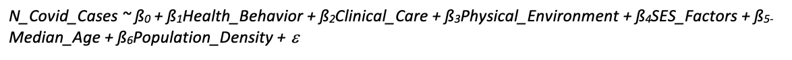
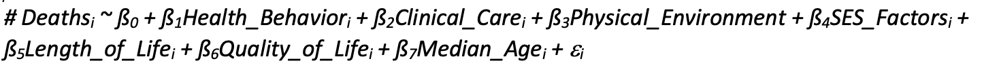
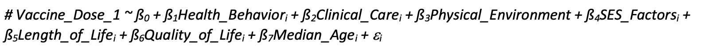
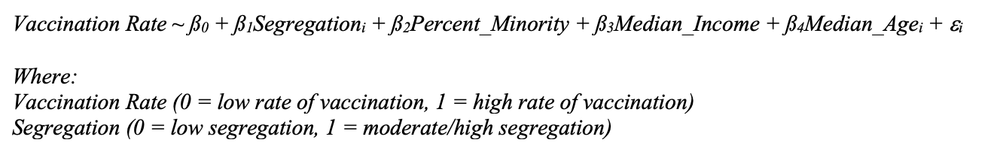

```{r setup, include=FALSE}
knitr::opts_chunk$set(echo = TRUE)
library(data.table)
library(tidycensus)
library(tidyverse)
library(ggridges)
library(patchwork)
library(viridis)
library(modelr)
library(mgcv)
library(readxl)
library(plotly)

knitr::opts_chunk$set(
	echo = TRUE,
	warning = FALSE,
	fig.width = 8, 
  fig.height = 6,
  out.width = "90%")

theme_set(theme_minimal() + theme(legend.position = "bottom"))

options(
  ggplot2.continuous.colour = "viridis",
  ggplot2.continuous.fill = "viridis")

scale_colour_discrete = scale_colour_viridis_d
scale_fill_discrete = scale_fill_viridis_d
```

## Data Processing and Cleaning

### Data Sources
Our data were downloaded from three different sources:

1. **New York State Demographics**: US Census Bureau's demographics data were imported using `tidycensus`.

2. **New York State Health Ranking** [(dataset)](https://www.countyhealthrankings.org/explore-health-rankings/new-york/data-and-resources):
Four data sets (2019, 2020, 2021 and 2022 New York State Health Ranking Data) were downloaded as .xls/xlsx. These data sets are provided by the University of Wisconsin Population Health Institute, which performs extensive analyses to calculate each New York county's score for health factors (health behaviors, clinical care, SES factors, and physical environment) and health outcome (quality of life, and length of life). 

3. **New York State COVID-19** [(dataset)](https://data.ny.gov/browse?tags=covid-19):
Three data sets (COVID testing, COVID vaccination, COVID fatalities from 2020 to 11/2022) were downloaded as .csv.

### Data Cleaning
1. **New York State Demographics**  
We imported US Census Bureau's 2020 data because 2021 data is not available until 12/8/2022. As demographics data do not change significantly each year, 2020 data were used for analysis. Then we decided to include the following variables, as we would like to adjust them in our models:
* total population in each county (tpop)
* median age in each county (medage)
* racial diversity index (race_div): calculated Simpson's Diversity Index in lines 65 to 69 (higher index indicates more racial diversity)

```{r census_data, results = FALSE, message = FALSE}
census_api_key("aa512886c5449a582d837da8d3a07af66a043fe5")

census_data <- load_variables(2020, "acs5", cache=T)
fwrite(census_data, "census_variables.csv")

vars <- c(tpop = 'P001001',
          medage = 'P013001',
          wpop = 'P003002',
          bpop = 'P003003',
          apop = 'P003005',
          hpop = 'P004003')

nys_df <- get_decennial(state = "ny", 
                       geography = "county",
                       variables = vars,
                       geometry = T,
                       output = "wide")

nys_df = nys_df %>%
  mutate(
    county = gsub(" County, New York","",NAME))

nys_df$race_div <- 1 - (((nys_df$wpop*(nys_df$wpop-1))+
                          (nys_df$bpop*(nys_df$bpop-1))+
                          (nys_df$hpop*(nys_df$hpop-1))+
                          (nys_df$apop*(nys_df$apop-1)))/
                         (nys_df$tpop*(nys_df$tpop-1)))

nys_df = nys_df %>% 
  select(tpop, medage, county, race_div)
```

2. **New York State Health Ranking**  
Same steps were taken for each year:
As the original excel files contain multiple sheets. We only imported the sheets that contain variables of interest.  
 <br>Each county's health ranking was imported from the sheet named "Outcomes & Factors SubRankings." From the sheet, only the following variables were selected for future analysis: each county's rank for health outcomes (quality of life, renamed to qol_r; length of life, renamed to longevity_r), health factors (health behaviors, renamed to health_beh_r; clinical_care, renamed to clinical_care_r; socioeconomic factors, renamed to ses_r; physical environment, renamed to env_r).
 <br>Additionally, further information on each county's socioeconomic factors and race/ethnicity were imported from the sheet named "Additional Measure Data." The following variables were selected: each county's segregation index (white vs. nonwhite), renamed to segregation_score; median household income, renamed household_income; % hispanic, p_hispanic; % black, renamed p_black). As we are interested in observing racial and socioeconomic disparities in COVID, we then created the following variables: % minority (hispanic + black), named p_minority; binary variable for low vs. moderate/high level of segregation. The cutoff value for level of segregation was set as 30. [(source)](https://www1.udel.edu/uapp800/Lecture%20Material/Index%20of%20Dissimilarity%20Example.htm)

```{r, results = FALSE, message = FALSE} 
# 2019 HR Data

hr2019 = read_excel('data/ny_hr19.xls', sheet = 'Outcomes & Factors SubRankings', skip = 1) %>% 
  janitor::clean_names() %>% 
  slice(-c(1)) %>% 
  select(-starts_with("z"), -fips, -state) %>% 
  rename(longevity_r = rank_5,
         qol_r = rank_7,
         health_beh_r = rank_9,
         clinical_care_r = rank_11,
         ses_r = rank_13,
         env_r = rank_15)

demo2019 = read_excel('data/ny_hr19.xls', sheet = 'Additional Measure Data', skip = 1) %>% 
  janitor::clean_names() %>% 
  slice(-c(1)) %>% 
  select('county', 
         'segregation_index_2',
         'household_income',
         'percent_hispanic',
         'percent_african_american') %>% 
  rename(median_income = household_income,
         segregation_score = segregation_index_2,
         p_hispanic = percent_hispanic,
         p_black = percent_african_american) %>%
    mutate(segregation = case_when(segregation_score < 30 ~ 0,
                                 segregation_score >= 30 ~ 1),
           p_minority = p_black + p_hispanic)

total2019 = merge(x = hr2019, y = demo2019, by = "county", all.x = TRUE) %>% 
  mutate(year = 2019)

# 2020 HR Data
hr2020 = read_excel('data/ny_hr20.xlsx', sheet = 'Outcomes & Factors SubRankings', skip = 1) %>% 
  janitor::clean_names() %>% 
  slice(-c(1)) %>% 
  select(-starts_with("z"), -fips, -state) %>% 
  rename(longevity_r = rank_5,
         qol_r = rank_7,
         health_beh_r = rank_9,
         clinical_care_r = rank_11,
         ses_r = rank_13,
         env_r = rank_15)

demo2020 = read_excel('data/ny_hr20.xlsx', sheet = 'Additional Measure Data', skip = 1) %>% 
  janitor::clean_names() %>% 
  slice(-c(1)) %>% 
  select('county', 
         'median_household_income', 
         'segregation_index_2',
         'percent_black',
         'percent_hispanic') %>% 
  rename(median_income = median_household_income, 
         segregation_score = segregation_index_2,
         p_black = percent_black,
         p_hispanic = percent_hispanic) %>% 
    mutate(segregation = case_when(segregation_score < 30 ~ 0,
                                 segregation_score >= 30 ~ 1),
           p_minority = p_black + p_hispanic)

total2020 = merge(x = hr2020, y = demo2020, by = "county", all.x = TRUE) %>% 
  mutate(year = 2020)

# 2021 HR Data
hr2021 = read_excel('data/ny_hr21.xlsx', sheet = 'Outcomes & Factors SubRankings', skip = 1) %>% 
  janitor::clean_names() %>% 
  slice(-c(1)) %>% 
  select(-starts_with("z"), -fips, -state) %>% 
  rename(longevity_r = rank_5,
         qol_r = rank_7,
         health_beh_r = rank_9,
         clinical_care_r = rank_11,
         ses_r = rank_13,
         env_r = rank_15)

demo2021 = read_excel('data/ny_hr21.xlsx', sheet = 'Additional Measure Data', skip = 1) %>% 
  janitor::clean_names() %>% 
  slice(-c(1)) %>% 
  select('county', 
         'median_household_income', 
         'segregation_index_2',
         'percent_black',
         'percent_hispanic') %>% 
  rename(median_income = median_household_income, 
         segregation_score = segregation_index_2,
         p_black = percent_black,
         p_hispanic = percent_hispanic) %>% 
    mutate(segregation = case_when(segregation_score < 30 ~ 0,
                                 segregation_score >= 30 ~ 1),
           p_minority = p_black + p_hispanic)

total2021 = merge(x = hr2021, y = demo2021, by = "county", all.x = TRUE) %>%
  mutate(year = 2021)

# 2022 HR Data
hr2022 = read_excel('data/ny_hr22.xlsx', sheet = 'Outcomes & Factors SubRankings', skip = 1) %>% 
  janitor::clean_names() %>% 
  slice(-c(1)) %>% 
  select(-starts_with("z"), -fips, -state) %>% 
  rename(longevity_r = rank_5,
         qol_r = rank_7,
         health_beh_r = rank_9,
         clinical_care_r = rank_11,
         ses_r = rank_13,
         env_r = rank_15)

demo2022 = read_excel('data/ny_hr22.xlsx', sheet = 'Additional Measure Data', skip = 1) %>% 
  janitor::clean_names() %>% 
  slice(-c(1)) %>% 
    select('county', 
         'median_household_income', 
         'segregation_index',
         'percent_black',
         'percent_hispanic') %>% 
  rename(median_income = median_household_income, 
         segregation_score = segregation_index,
         p_black = percent_black,
         p_hispanic = percent_hispanic) %>% 
    mutate(segregation = case_when(segregation_score < 30 ~ 0,
                                 segregation_score >= 30 ~ 1),
           p_minority = p_hispanic + p_black)

total2022 = merge(x = hr2022, y = demo2022, by = "county", all.x = TRUE) %>% 
  mutate(year = 2022)

# Merge
hr_all = rbind(total2019, total2020, total2021, total2022)
```

3. **New York State COVID-19**  
From the three data sets we extracted the following variables of interest: number of new COVID cases per day, cumulative number of deaths reported per day, cumulative # of individuals who received the first dose of the vaccine. For the data set with cumulative number of deaths, the county "Manhattan" was replaced with "New York" for consistency. Next, the three data sets were merged by "date" and "county." The merged data set was then grouped according to "county" and "year" and the following variables were created: total number of new positive cases per year, called n_cases; total number of deaths per year, called n_deaths; and total number of individuals who received the first dose of the vaccine per year, called vax_dose1 (this data is not available for year 2020).

```{r, results = FALSE, message = FALSE, warnings = FALSE}
ny_test = read_csv('data/ny_covidtest.csv') %>% 
janitor::clean_names() %>% 
filter(geography == 'COUNTY') %>% 
select(-geography) %>% 
rename(date = test_date) %>% 
mutate(date = lubridate::mdy(date))  

ny_death = read_csv("data/ny_coviddeaths.csv") %>% 
janitor::clean_names() %>% 
rename(date = report_date, n_fatality = place_of_fatality) %>%
select(-deaths_by_county_of_residence) %>% 
mutate(date = lubridate::mdy(date), county = replace(county, county == 'Manhattan', 'New York'))

ny_vax = read_csv("data/ny_covidvax.csv") %>% 
janitor::clean_names() %>% 
rename(date = report_as_of) %>% 
select(-region, -series_complete) %>% 
mutate(date = lubridate::mdy(date))

ny_covid_v1 = left_join(ny_test, ny_death, by = c("date", "county"))

covid_df_v1 = left_join(ny_covid_v1, ny_vax, by = c("date", "county")) %>% 
  separate(date, c("year", "month", "day"), sep = "-") %>% 
  mutate(year = as.numeric(year), month = as.numeric(month), day = as.numeric(day))

covid_df = covid_df_v1 %>% 
  group_by(year, county) %>% 
  summarise(n_cases = sum(new_positives),
            vax_dose1 = max(first_dose),
            n_deaths = max(n_fatality, na.rm = TRUE))
```

4. **Dataset for Analysis**  
For regression tests, demographics dataset, HR dataset, and COVID dataset were all merged into one dataset called "comb." At the end, we added a new binary variable called vax_maj to see whether majority of the residents in the county had received the first dose of vaccine. The cutoff value used was 73% as it was reported that nearly ~73% of the US population had completed at least the first dose of vaccine by the end of 2021. [(source)](https://usafacts.org/visualizations/covid-vaccine-tracker-states#:~:text=Percent%20of%20people%20receiving%20vaccines%20in%20the%20US&text=*%20In%20Dec.,vaccination%20coverage%20estimates%20between%20jurisdictions.)  

```{r, results = FALSE, message = FALSE}
covid_hr = left_join(covid_df, hr_all, by = c("county", "year"))
comb = left_join(covid_hr, nys_df, by = 'county') %>% 
  mutate(tpop_50 = tpop/2,
         vax_maj = case_when(vax_dose1 >= .73*(tpop) ~ 1,
                             vax_dose1 < .73*(tpop) ~ 0))
```

## Statistical Analysis

Note: Though we initially planned to adjust for racial diversity in our model, the variable was removed because racial diversity index did not vary much among counties. For each model, only data from 2021 was used because there is no information on 2020 vaccination as the vaccine was developed in 2021 and 2022 data is incomplete.

<p style="color: red">***Question 1: Which health factors are associated with COVID-19 incidence?***</p>
Health factors -- health behaviors, clinical care, physical environment, and socioeconomic factors -- are community conditions that can be modified and improved through public health interventions or health policies. Therefore, we were interested in seeing which factor(s) is significantly associated with the number of COVID-19 cases, COVID-19 deaths, and COVID-19 vaccination. To do so, we ran multiple linear regression test.

**Model 1**


```{r}
m1 = comb %>% 
  filter(year == '2021') %>% 
  lm(n_cases ~ health_beh_r + clinical_care_r + env_r + ses_r + longevity_r + qol_r + medage, data = .)

m1 %>% 
  broom::tidy() %>% 
  select(term, estimate, p.value) %>% 
  knitr::kable(digits = 3) 
```

After adjusting for median age and health outcome variables, health behaviors, clinical care, and SES factors were shown to be significantly associated with COVID-19 incidence (p < .05). Health behaviors score is based on the community residents' tobacco use, diet & exercise, alcohol & drug use, and sexual activity (i.e., number of STI/STD). Lelve of clinical care is determined by access to care and quality of care. Lastly, SES factors are comprised of education, employment, income, family & social support, and community safety. Since factors such as unequal access to healthcare, high-quality education, increased use of drug and alcohol, etc. are well-known, potential drivers of health inequity. The results warrant further exploration of interaction between these factors and race/ethnicity. 

To test the validity of our results, we checked regression assumptions.

```{r m1_check}
plot(m1)
```

The residual vs. fitted plot does not show strong pattern; however, the points are not perfectly, randomly scattered around residual = 0. The residual vs. leverage plot confirms that our model does not have any influential points because no point falls outside Cook's distance. Meanwhile, scale-location plot indicates a potential violation of heteroscedasticity. Lastly, for the normal Q-Q plot, there appears to be no extreme skewness with majority of the points falling along the line. Some deviations at the lowest and highest quartile suggest that random fluctuation may be seen at extreme ends. Therefore, these plots indicate that our model, though sufficient, can be improved (i.e., add interaction terms, adjust for more variables) and there is more to be explored.

**Model 2**

```{r}
m2 = comb %>% 
  filter(year == '2021') %>% 
  lm(n_deaths ~ health_beh_r + clinical_care_r + env_r + longevity_r + qol_r + medage, data = .)

m2 %>% 
  broom::tidy() %>% 
  select(term, estimate, p.value) %>% 
  knitr::kable(digits = 3) 
```

As seen with model 1, model 2 indicates that all health factors except physical environment are significantly associated with number of deaths related to COVID-19 in each county (p < .05). Since physical environment score is based on air/water quality and housing/transit conditions within the county, this suggests that public health professionals can aim to mitigate disparities in COVID-19 by first starting short-term community-based public health interventions aimed at encouraging residents to building healthier lifestyles.

```{r m2_check}
plot(m2)
```

Results of regression assumption tests were also similar to that of model 1's, indicating that there is more to be explored in the association between health factor and COVID-19 fatalities.

**Model 3**

```{r}
m3 = comb %>% 
  filter(year == '2021') %>% 
  lm(vax_dose1 ~ health_beh_r + clinical_care_r + env_r + ses_r + longevity_r + qol_r + medage, data = .,)

m3 %>% 
  broom::tidy() %>% 
  select(term, estimate, p.value) %>% 
  knitr::kable(digits = 3) 
```

Unlike models 1 and 2, model 3 indicates that neither clinical care nor physical environment scores are significantly associated with the rate of COVID vaccination (p > .05). This can potentailly be because the COVID vaccine was available not only at hospitals but also at locations such pharmacies (CVS, Walgreen, etc.) and community health centers, removing the barrier to healthcare access. Meanwhile, significant associations with health behaviors and SES factors (p < .05) reinforce the need to address root causes of health inequity such as residential segregation.

```{r}
plot(m3)
```

Regression assumption tests, once again, show room for improvement in our model and the need for further analysis

<p style="color: red">***Question 2: Which health factors are associated with COVID-19 incidence?***</p>

**Model 4**


**Model 5**

